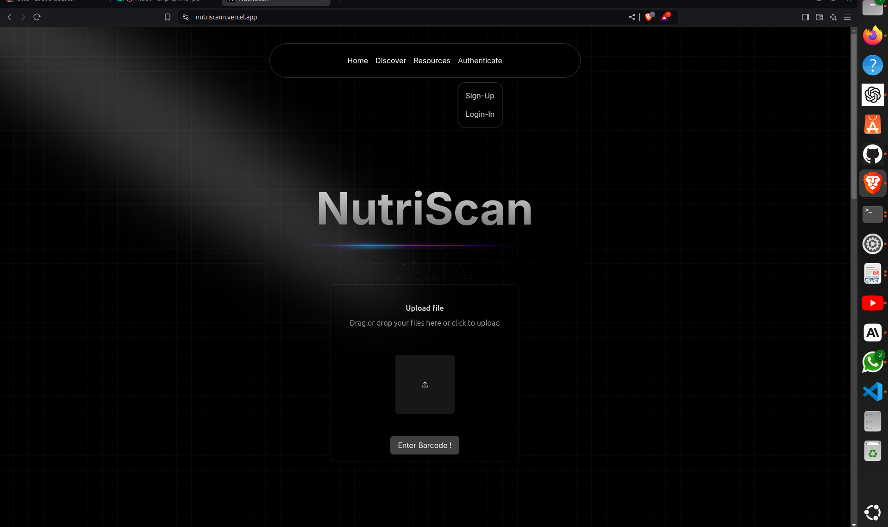
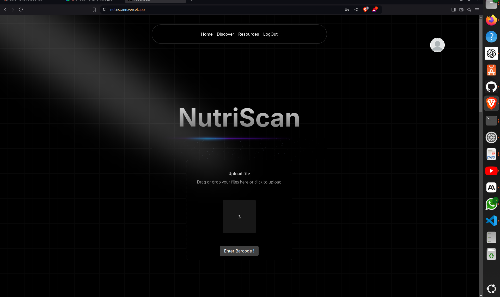
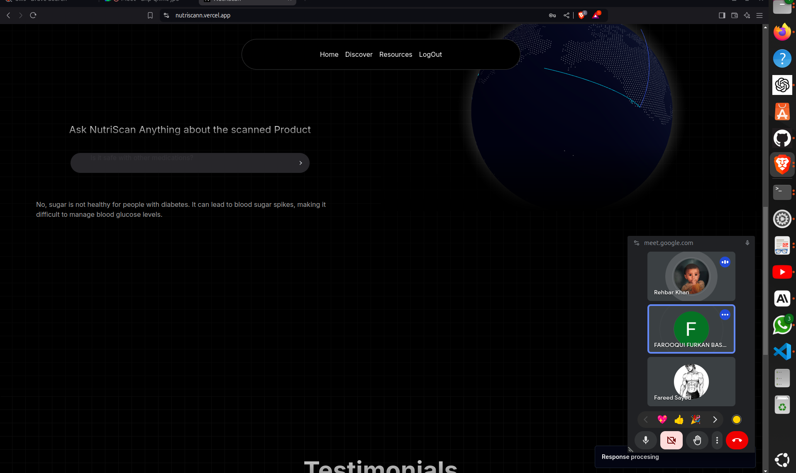
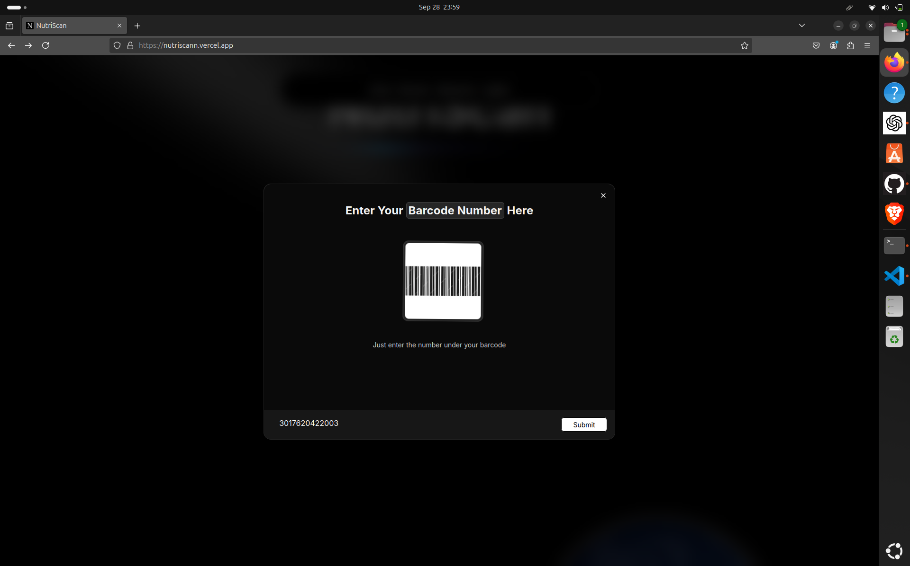
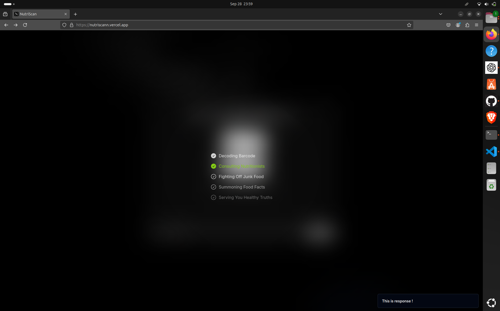
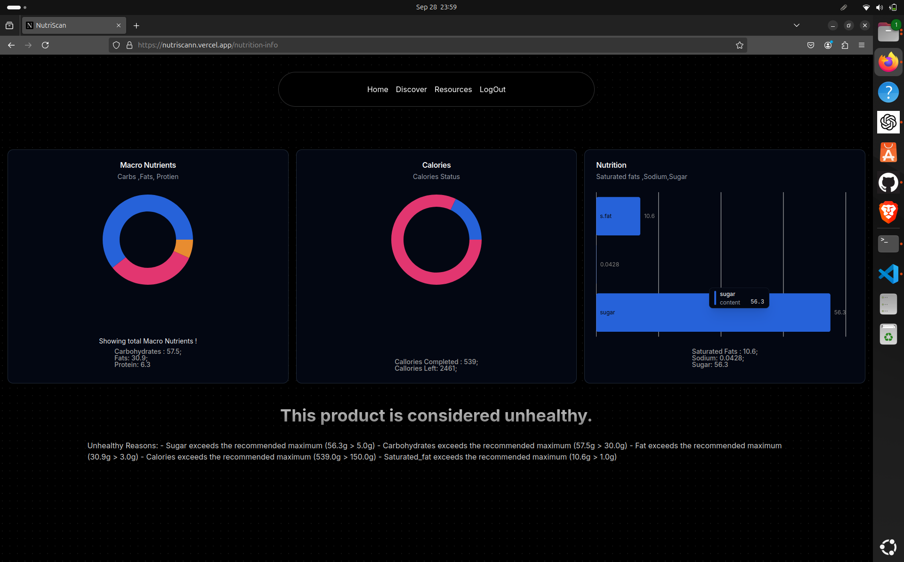
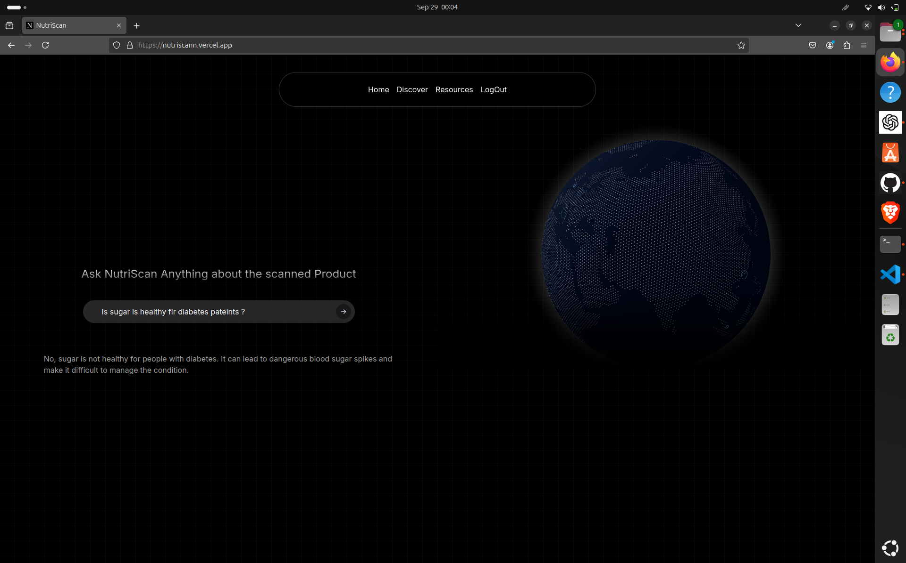
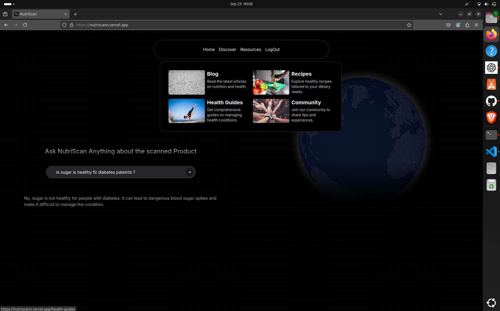
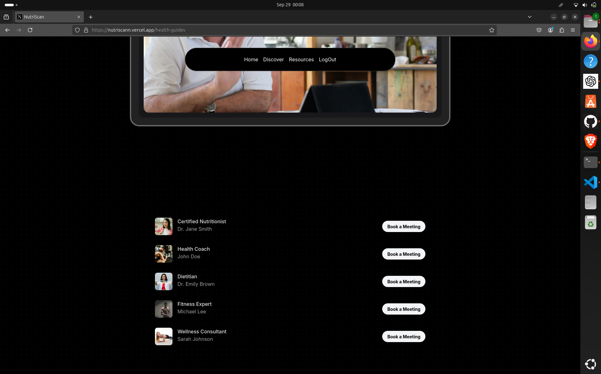

# NutriScan

**NutriScan** is an AI-powered platform that empowers users to make informed and healthier dietary choices by scanning or uploading images of food and medicine labels. It analyzes nutritional content, flags allergens, and assesses dietary suitability based on individual health conditions. Whether you're managing diabetes, heart disease, or other conditions, NutriScan provides the information you need to make better food choices effortlessly. The app even suggests healthier alternatives to promote a balanced diet.

## 🚀 About Our Project

In today’s fast-paced world, determining whether a food product is suitable for someone with specific health conditions can be difficult. Understanding labels, nutritional values, and ingredient details takes time and expertise. This becomes critical for individuals with diseases like diabetes, where sugar, sodium, or other components must be closely monitored.

**NutriScan** simplifies this process.

Just by scanning a barcode, NutriScan analyzes the product and instantly provides detailed nutritional insights such as sugar, fat, protein, and sodium content. The app cross-references this data with the user's health conditions, such as diabetes, hypertension, or allergies, to assess whether the product is safe or poses any health risks.

Our platform also goes a step further by suggesting healthier alternatives that better align with the user's dietary requirements, encouraging sustainable and healthy eating habits.

## 🎯 Key Features
- **Barcode & Image Scanning**: Scan barcodes or upload images of food and medicine labels to get instant nutritional breakdowns.
- **Allergen Alerts**: Receive warnings about common allergens like gluten, dairy, nuts, and more.
- **Dietary Suitability**: Get insights into whether a product is appropriate for individuals with specific health conditions such as diabetes, high blood pressure, and more.
- **Healthier Alternatives**: Receive suggestions for healthier product alternatives based on your preferences and health needs.
- **User-Friendly Interface**: A clean and intuitive interface makes scanning and reviewing product information seamless.

## 🔧 Technologies Used
- **Frontend**:  Next.js
- **Backend**: Django, Python
- **AI & Image Recognition**: AI models to analyze product labels and nutritional data
- **Ml Libraries**: OpenCV2, Recognition model
- **Devops Technologies**: CI/CD pipeline to check secrets, to automate deploy, Docker, Shell Scripting
- **Database**: PostgreSQL, SQlite
- **APIs**: Barcode recognition API, Nutrition API, Open Food Facts

## 🏁 How to use
To get started with NutriScan:

## Requirements
This is the main page of the NutriScan website. To access the platform's features, authentication is required. This ensures that your history and personalized data are securely stored for a tailored user experience

## To use
On the landing page, you have two options: either scan the barcode directly or manually enter the barcode for analysis.
To enter manualy you can enter the barcode number in the given text area

Simply put the barcode there.
Now, Suppose if we are using barcode 3017620422003 --> Nutella
!Let make a scan

## Output 

###
You can see that This product is considered **unhealthy** due to several reasons mentioned 
## Using Chatbot 

The chatbot is here to guide you through your entire dietary process and provide answers to any product-related questions you might have. Whether you're looking for nutritional details, ingredient information, or even personalized dietary advice, the chatbot can assist you every step of the way. If you need help with meal planning, understanding product labels, or have any specific dietary concerns, feel free to ask. It’s designed to make your health journey smoother by offering tailored support for all your dietary needs.

## Health guides

Want to receive some valuable health tips and guidance? Connect with our industry experts who can provide you with tailored advice and insights. Whether you have questions about nutrition, fitness, or overall wellness, our knowledgeable professionals are here to help you navigate your health journey effectively. Don't hesitate to reach out for personalized support and discover the best practices for maintaining a healthy lifestyle.

You can schedule meetings with any of the health guides that you're most comfortable with. Whether you're seeking advice on nutrition, fitness, or overall wellness, our experts are ready to assist you. Simply choose a guide that resonates with your needs, and book a session to receive personalized insights and support tailored to your health journey.

# For Developers 
Nutriscan is an open-source platform that encourages developers to contribute. If you're interested in getting involved, please read the [DEVELOP.md](./DEVELOP.md) file for comprehensive guidelines on how to contribute effectively. Your contributions can help enhance the platform and make a meaningful impact in the community!
